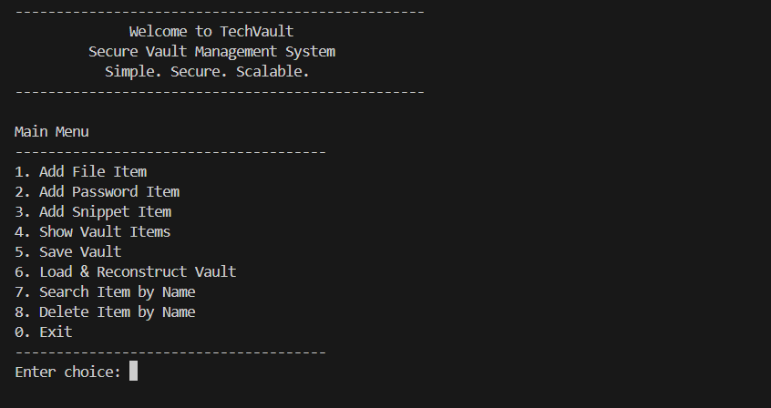

# 🔐 TechVault  
## Secure Vault Management System (C++)


TechVault is a **menu-driven C++ application** that allows users to securely store, encrypt, and manage sensitive data such as files, passwords, and code snippets.  
The project demonstrates **clean object-oriented design**, **design patterns**, and **real-world C++ project structure**.

---

## 📌 Project Overview

TechVault is designed as a **command-line vault system** where different types of sensitive data are managed through a unified interface.  
It focuses on **scalability, modularity, and maintainability**, and is designed with clean architecture to support future expansion and real-world system complexity.

---

## 🚀 Features

- 📁 Add and manage **File metadata** (name, type, size)
- 🔑 Store **Password entries** securely (password hidden on display)
- 💻 Manage **Code Snippets**
- 🔐 Encryption using **Strategy Pattern**
- 🏭 Dynamic object creation using **Factory Pattern**
- 💾 Save encrypted vault data to persistent storage
- 🔄 Load and reconstruct objects from encrypted storage
- 🔍 Search vault items by name
- ❌ Delete vault items with confirmation
- 📜 Logging system for storage operations
- 🧭 Interactive menu-driven CLI
- 🛡 Input validation and error handling

---

## 🧠 Design & Architecture

### Object-Oriented Principles Used
- **Encapsulation** – Bundling data and related methods
- **Inheritance** – Shared behavior via base classes
- **Polymorphism** – Runtime behavior using virtual functions
- **Abstraction** – Interfaces for encryption, logging, and storage

### Design Patterns Implemented
- **Strategy Pattern**  
  Used for encryption logic to allow easy switching of algorithms.

- **Factory Pattern**  
  Centralized creation of vault items, keeping `main()` clean.

- **RAII (Resource Acquisition Is Initialization)**  
  Ensures proper memory management and cleanup.

---

## 🗂 Project Structure

```text
TechVault/
│
├── include/                  # Header files
│   ├── Encryptor.h
│   ├── VaultItem.h
│   ├── FileItem.h
│   ├── PasswordItem.h
│   ├── SnippetItem.h
│   ├── Logger.h
│   ├── Storage.h
│   ├── VaultManager.h
│   └── VaultItemFactory.h
│
├── src/                      # Source files
│   ├── Encryptor.cpp
│   ├── VaultItem.cpp
│   ├── FileItem.cpp
│   ├── PasswordItem.cpp
│   ├── SnippetItem.cpp
│   ├── Logger.cpp
│   ├── Storage.cpp
│   ├── VaultManager.cpp
│   ├── VaultItemFactory.cpp
│   └── main.cpp
│
├── data/                     # Encrypted runtime data (ignored by git)
│   ├── local_storage.txt
│   └── cloud_storage.txt
│
├── README.md
└── techvault.exe

```
### ⚙️ How to Build & Run

#### 🔧 Step 1: Compile the Project

Open a terminal **in the project root directory (TechVault)** and run:

```bash
g++ src/*.cpp -Iinclude -o techvault

```
### ▶️ Step 2: Run the Application

After successful compilation, run the executable.

#### 🪟 Windows
```bash
techvault.exe
```
#### 🐧 Linux / 🍎 macOS
```bash
./techvault
```

### Welcome and Main Menu

